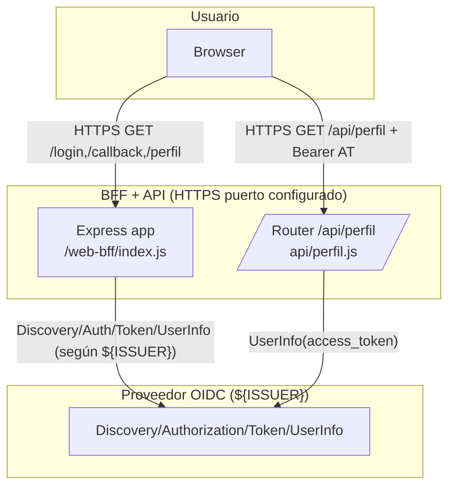

### Sección 2 – Análisis de Arquitectura y Riesgos

#### 2.1 Activos y datos
- **Sesión HTTPOnly y segura**: la cookie `session` persiste el identificador de sesión con políticas `secure`, `httpOnly`, `sameSite=lax` y caducidad de 24 h, ofreciendo una base sólida para proteger el flujo de autenticación.
- **Parámetros de correlación OIDC**: el BFF genera y guarda en sesión `code_verifier`, `oidc_state` y `oidc_nonce`, asegurando continuidad del intercambio de autorización.【F:web-bff/index.js†L67-L133】
- **Tokens OIDC**: el callback conserva `id_token`, `access_token` y `refresh_token` en la sesión para uso del BFF y de la API interna.
- **Material TLS local**: certificados `ssl/key.pem` y `ssl/cert.pem` habilitan el despliegue del BFF sobre HTTPS con claves alojadas en el repositorio.
- **Configuración sensible**: variables de entorno (`SESSION_SECRET`, `ISSUER`, `CLIENT_ID`, `PORT`, `HOST`) gobiernan la inicialización del cliente OIDC y el servidor HTTPS.

#### 2.2 Contexto y supuestos implementados
- **Cliente OIDC público con descubrimiento automático**: la app descubre el `issuer` en tiempo de arranque y crea un cliente sin secreto (`token_endpoint_auth_method: "none"`), reflejando una integración ligera con el IdP.
- **Protecciones de flujo de autorización**: `/login` aplica PKCE (S256), `state` y `nonce`, almacenando los valores en sesión y reusándolos en `/callback` para el canje del código, lo que refuerza la resistencia a ataques de replay y CSRF.
- **Servidor unificado BFF + API**: el router `/api/perfil` se monta en el mismo proceso Express, beneficiándose de la sesión y de la inicialización compartida del cliente OIDC.
- **Exposición segura al usuario**: la aplicación se publica mediante `https.createServer` usando los certificados locales, proporcionando cifrado de extremo a extremo hacia el navegador.
#### 2.3 DFD (Mermaid)

**Fronteras de confianza**: cifrado TLS entre el usuario y el BFF/API gracias al servidor HTTPS local; la conexión al IdP seguirá el esquema definido en `ISSUER`, que puede ser HTTPS si así se configura.

#### 2.4 STRIDE (amenazas aplicables)
- **Suplantación**: la API valida el `access_token` delegando en `client.userinfo(accessToken)`; mientras la llamada sea protegida por el esquema del `ISSUER`, se minimiza el riesgo de aceptar tokens fabricados.
- **Manipulación**: el uso de PKCE, `state` y `nonce` en `/login` y `/callback` mitiga modificaciones maliciosas del flujo de autorización, preservando la integridad de los parámetros.
- **Revelación de información**: la cookie de sesión aplica controles `secure` y `httpOnly`, reduciendo la exposición de tokens y secretos de correlación en el cliente, siempre que el despliegue mantenga HTTPS extremo a extremo.
- **Denegación de servicio**: ante fallos de descubrimiento del `issuer`, la app aborta la ejecución con `process.exit(1)`, protegiendo la consistencia pero pudiendo interrumpir el servicio hasta el siguiente arranque.
- **Elevación de privilegios**: el router `/api/perfil` exige cabecera `Authorization` Bearer y se apoya en el cliente OIDC inicializado, limitando el acceso a datos de usuario sólo a tokens válidos.

#### 2.5 Matriz de riesgos
| Riesgo real | Prob. (1-5) | Impacto (1-5) | Justificación |
| --- | --- | --- | --- |
| Interrupción por fallo de descubrimiento OIDC | 2 | 3 | Un error del `issuer` provoca `process.exit(1)`, deteniendo el servicio hasta que se reinicie, aunque protege de operar sin configuración válida. |
| Dependencia de la validación remota de tokens | 3 | 3 | La API confía en `client.userinfo(accessToken)`; si el IdP está indisponible se degrada la disponibilidad, pero mientras esté accesible mantiene la validación centralizada |
| Protección de sesión dependiente de despliegue TLS | 3 | 4 | La cookie `session` es `secure`/`httpOnly` y el servidor usa HTTPS local; configuraciones sin TLS extremo podrían reducir la protección, aunque la base del código promueve cifrado. |
